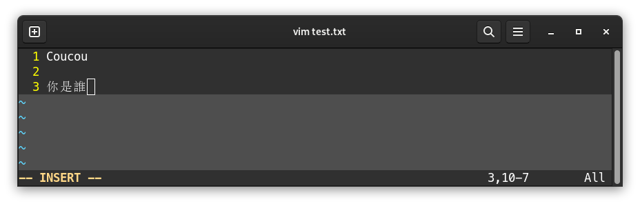
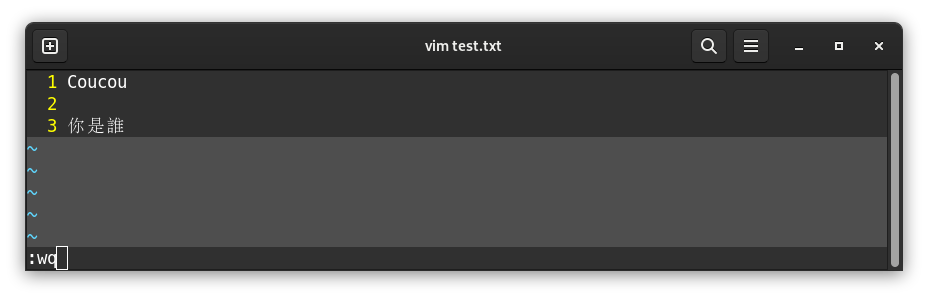
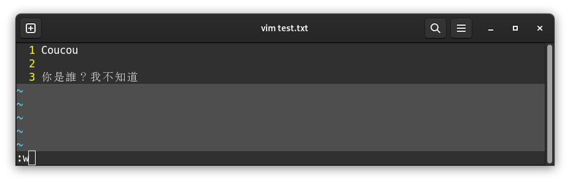
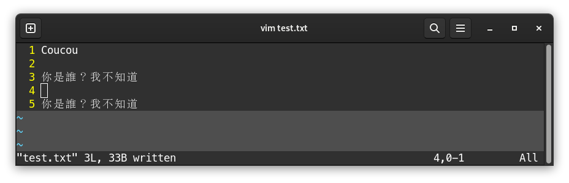
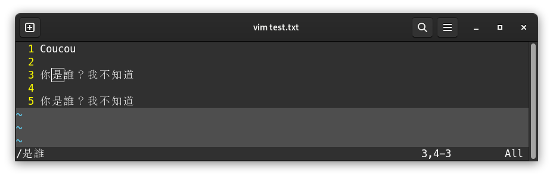
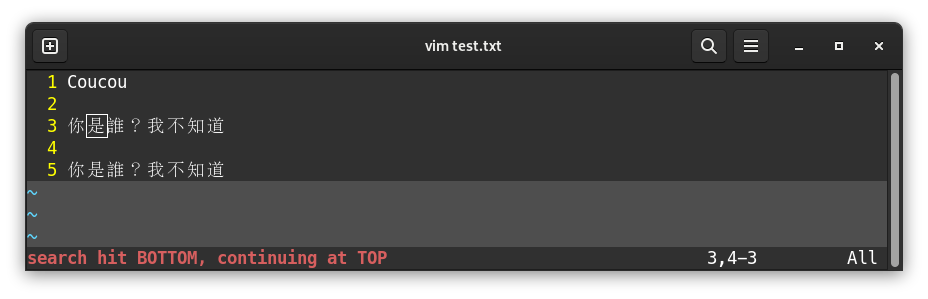

# VIM Memo

[VIM](https://www.vim.org/) is a command-line text editor included in most of Linux distributions.

It's very useful when no GUI (Graphical User Interface) is available, to edit and save files.

## Installation

To install VIM, for example on Debian:

```bash
sudo apt-get install -y vim
```

## Open a file with VIM

To open a file, from a shell:

```bash
vim /path/to/file.ext
```

:::note

If file doesn't exist, it will be created at first save

:::

<div style={{ textAlign: "center" }}>


</div>

## Edit a file

When the file is open, **it's impossible to directly write into it**:

<div style={{ textAlign: "center" }}>


</div>

To be able to write into it, press the `i` key to switch to **insertion** mode (`-- INSERT --` should appear at the bottom of the screen):

<div style={{ textAlign: "center" }}>


</div>

It's then possible to edit the file:

<div style={{ textAlign: "center" }}>



</div>

Once you're finished with writing contents, press the `Echap` key to quit insertion mode. `-- INSERT --` disappears from the bottom screen, and it's not possible to write into the file:

<div style={{ textAlign: "center" }}>


</div>

Once `Echap` is pressed, one may want to quit, save (or both at the same time), or quit without saving (after a mistake), etc...

To perform these actions, there are various **commands**.

## Run a command

After leaving insertion mode with `Echap`, it's possible to run a command on the file: save, save & quit, go to line, copy, paste...

To run a command, first press `:` key, and then type the command.

### Save and quit

To save and quit: `:wq`

<div style={{ textAlign: "center" }}>



</div>

We can then check if the file was correctly saved:

<div style={{ textAlign: "center" }}>


</div>

### Save without quitting

To save only (without quitting): `:w`

If we add text into a file, and then press `Echap` and `:w`:

<div style={{ textAlign: "center" }}>



</div>

Then `Enter`:

<div style={{ textAlign: "center" }}>


</div>

It is then possible to switch back to insertion mode to continue editing the file.

### Quit without saving

To quit VIM without saving the file: `:q!`

### Go to line

To go to a line `XXX`, first press `:` then the line number: `:XXX`

### Display line numbers

On the left side, if there are no line numbers, display it with `:set nu`

### Enable syntax highlighting

Syntax highlighting should be automatic. VIM has built-in suppot for hundreds of programming languages and file formats.

However, if the file doesn't have syntax highlighting, it's possible to enable it with `:syn on`.

It is then possible to apply a color theme with, for instance, `:colo desert`.

## Cut/Copy/Paste

In command mode, it's possible to cut/copy/paste lines.

For these features, there is no need to press `:` prior to the command.

Pressing `d` 2 times (so `dd`) cuts the current line.

Pressing `y` 2 times (so `yy`) copies the current line.

Then, to paste cut or copied contents, press `p`.

:::note

To cut or copy multiple lines at once, enter a number before `dd` or `yy`

For instance, below we want to copy/paste lines 2 and 3. We place the cursor on the first line we want to copy, line 2:

<div style={{ textAlign: "center" }}>


</div>

We enter `2yy`, and then go to line 3 and press `p`:

<div style={{ textAlign: "center" }}>



</div>

Pasted content goes below line 3, and doesn't replace the current line.

:::

## Find text

To find text, we won't use `:` but rather `/`, followed by the text. Then we run the search with `Enter`:

<div style={{ textAlign: "center" }}>



</div>

VIM places the cursor on the first found occurence. If there are multiple results, such as below, it's possible to go to the next result by pressing `n`. If the search reaches end of file, VIM goes back to the first occurence, and notifies it at the bottom of the screen:

<div style={{ textAlign: "center" }}>



</div>

To go to previous occurence, press `N` instead of `n`.
