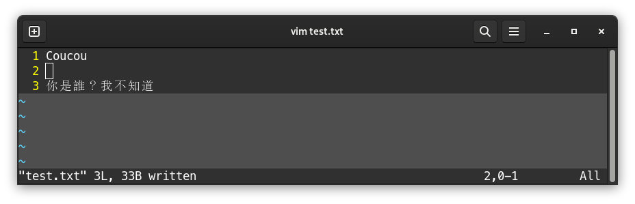

# Mémo VIM

[VIM](https://www.vim.org/) est un éditeur de texte en ligne de commande inclus sur la plupart des distributions Linux.

Il est très utile quand on se trouve sur un système sans aucune interface utilisateur, pour éditer et sauvegarder des fichiers.

## Installation

S'il n'est pas installé, alors, sur Debian par exemple, très simplement :

```bash
sudo apt-get install -y vim
```

## Ouvrir un fichier avec VIM

Pour ouvrir un fichier, exécuter directement la commande `vim` depuis un shell :

```bash
vim /path/to/file.ext
```

:::note

Si le fichier n'existe pas, il sera créé automatiquement à la première sauvegarde

:::

<div style={{ textAlign: "center" }}>


</div>

## Éditer un fichier

Une fois le fichier ouvert, **on ne peut pas l'éditer directement** :

<div style={{ textAlign: "center" }}>


</div>

Pour pouvoir l'éditer, il faut passer en mode **insertion** avec la touche `i` (en bas, `-- INSERT --` apparaît) :

<div style={{ textAlign: "center" }}>


</div>

On peut alors éditer le fichier comme on le souhaite :

<div style={{ textAlign: "center" }}>


</div>

Une fois l'édition terminée, pour quitter le mode insertion, appuyer sur `Echap`. `-- INSERT --` disparaît en bas, et on ne peut plus écrire dans la zone :

<div style={{ textAlign: "center" }}>


</div>

Une fois la touche `Echap` pressée, on aimerait peut-être quitter, sauvegarder, les deux à la fois, ou bien quitter sans sauvegarder car on a fait une bêtise, etc...

Pour réaliser ces actions, on va exécuter une commande.

## Exécuter une commande

Une fois qu'on est sorti du mode insertion avec `Echap`, on peut exécuter une commande sur le fichier en cours d'édition.

Par exemple, sauvegarder, sauvegarder et quitter, se rendre à une ligne, copier une ligne, coller...

Pour exécuter une commande, une fois sorti du mode insertion, on appuyera sur la touche `:` puis on saisira la commande.

### Sauvegarder et quitter

Pour sauvegarder et quitter : `:wq`

<div style={{ textAlign: "center" }}>


</div>

On peut ensuite afficher le contenu du fichier pour vérifier qu'il a bien été sauvegardé :

<div style={{ textAlign: "center" }}>


</div>

### Sauvegarder sans quitter

Pour sauvegarder sans sortir de VIM : `:w`

Si on ajoute du texte en rouvrant le fichier avec `vim test.txt` et en passant en mode insertion, puis qu'on passe en mode commande avec `Echap` :

<div style={{ textAlign: "center" }}>


</div>

On appuie ensuite sur `Entrée` :

<div style={{ textAlign: "center" }}>


</div>

On peut ensuite repasser en mode insertion pour écrire du texte dans le fichier.

### Quitter sans sauvegarder

Pour quitter directement VIM, sans sauvegarder le fichier : `:q!`

### Aller directement à un numéro de ligne

Pour se rendre directement à une ligne `XXX`, appuyer sur `:` et entrer directement le numéro voulu : `:XXX`

### Activer les numéros de ligne

Sur la gauche de l'interface, si on n'a pas les numéros de ligne, on peut les afficher avec `:set nu`

### Activer la coloration syntaxique

Normalement, la coloration syntaxique devrait être automatique. VIM supporte des centaines de langages de programmation et formats de fichier.

Si toutefois le fichier n'était pas correctement colorié, on peut activer la coloration avec `:syn on`.

On pourra ensuite compléter avec l'application d'un thème de couleur, par exemple `:colo desert`.

## Couper/Copier/Coller

En mode commande, on peut également couper/copier/coller des lignes.

Dans ce cas, pas besoin d'appuyer sur `:`.

En appuyant deux fois sur `d`, donc `dd`, on peut couper une ligne.

En appuyant deux fois sur `y`, donc `yy`, on peut copier une ligne.

Ensuite, pour coller une ligne, on peut appuyer sur `p` directement.

:::note

Pour couper ou copier plusieurs lignes d'un coup, avant d'entrer `dd` ou `yy`, on peut saisir un nombre.

Par exemple, copions-collons les lignes 2 et 3 de notre fichier. On se place sur la première ligne qu'on veut copier, donc la ligne 2 :

<div style={{ textAlign: "center" }}>



</div>

On tape ensuite `2yy` (car on souhaite copier **2 lignes**), puis on vient en ligne 3 et on appuie sur `p` :

<div style={{ textAlign: "center" }}>


</div>

On remarque que le collage vient en-dessous de la ligne 3, il ne remplace pas la ligne existante.

:::

## Chercher du texte

Pour chercher du texte, on n'utilisera pas les deux points `:`, mais un slash `/` suivi du texte cherché. On validera la recherche avec `Entrée` :

<div style={{ textAlign: "center" }}>


</div>

Vim vient nous placer directement sur la première occurence trouvée. Si on a plusieurs résultats, comme c'est le cas ici, alors on peut passer au suivant avec la touche `n`. Si on atteint la fin du fichier, VIM nous présente de nouveau la première occurence trouvée, en nous l'indiquant en bas de la fenêtre :

<div style={{ textAlign: "center" }}>


</div>

Pour aller à l'occurence précédente, on peut taper `N` au lieu de `n`.
